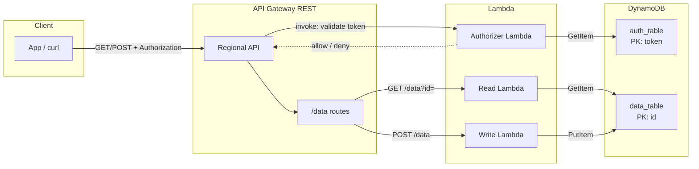

# Serverless API (Terraform + AWS)

This folder defines a small **serverless HTTP API** on AWS: a **regional REST API** in **API Gateway**, three **Node.js Lambdas** (authorizer, read, write), and two **DynamoDB** tables. Everything is declared in **Terraform**; Lambda code lives under `src/` and is zipped at apply time (after `npm install`).

## What it does

1. **Clients** call the API with an **`Authorization`** header (typically `Bearer <token>`).
2. A **Lambda authorizer** checks that the token exists as a partition key in **`auth_table`** (`token`).
3. If the authorizer allows the request, **API Gateway** forwards it to the right function:
   - **`GET /data?id=...`** → **read** Lambda → loads an item from **`data_table`** by `id`.
   - **`POST /data`** → **write** Lambda → saves an item into **`data_table`** (JSON body includes `id` and optional `attributes`).

IAM is scoped so each Lambda only talks to the DynamoDB table it needs, plus CloudWatch Logs.

## Project layout

| Path | Purpose |
|------|---------|
| `main.tf` | Terraform + AWS provider |
| `variables.tf` | Region and name prefix (`project_name`) |
| `dynamodb.tf` | `data_table` (PK `id`), `auth_table` (PK `token`), low provisioned capacity |
| `lambda.tf` | IAM, CloudWatch log groups, npm install + zip, three Lambdas |
| `api_gateway.tf` | REST API, TOKEN authorizer, `/data` GET/POST, deployment, **`prod`** stage |
| `outputs.tf` | API base URL and example endpoints |
| `src/authorizer/` | Authorizer (AWS SDK v3) |
| `src/read/` | Read handler |
| `src/write/` | Write handler |

## How to run it

From this directory, configure AWS credentials (profile or env vars), then:

```bash
terraform init
terraform plan
terraform apply
```

Use `terraform output` for the invoke URL (it includes the **`prod`** stage path, e.g. `…/prod/data`).

**Before first use:** put a valid token item in **`auth_table`** (attribute **`token`** = the secret you send after `Bearer `). Then call the API with that header.

## Architecture



**Flow in words:** every request hits API Gateway with an **Authorization** header. Gateway runs the **authorizer** first; it reads **`auth_table`**. Only if that succeeds does **GET** run **read** against **`data_table`**, or **POST** run **write** against **`data_table`**.
